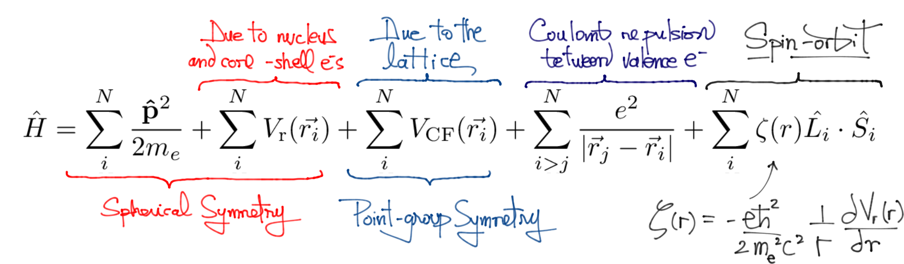

***

`qdef` is a collection of code and data used to approximate the optical properties of ions in crystals. It is an amalgam of group theory tables, spectroscopic databases, and experimental data for crystal field Hamiltonians. For a given crystal host and dopant species, `qdef` can give a picture of the qualitative level structure and transition rules, and it can also give approximate quantitative results for quantities of interest such as energy levels, and transition rates.

For a more thorough explanation of what is included check out [this notebook](https://github.com/zia-lab/qdef/blob/main/qdef.ipynb).

For its calculations `qdef` owes a debt of gratitude to many. 

+ Its group theory tables were obtained from [GTPack](https://gtpack.org).
+ The wonderful collection of coefficients of fractional-parantage from [Velkov](https://www.proquest.com/docview/304605104?) was thoroughly appreciated.
+ The spectroscopic data was parsed from thorough [spectroscopic databases](https://www.nist.gov/pml/atomic-spectra-database) from NIST.
+ The books of [Griffith](https://www.google.com/books/edition/The_Theory_of_Transition_Metal_Ions/vv08AAAAIAAJ?), [Cowan](https://www.google.com/books/edition/The_Theory_of_Atomic_Structure_and_Spect/avgkDQAAQBAJ?), [Tanabe, Sugano, and Kamimura](https://www.google.com/books/edition/Multiplets_of_Transition_metal_Ions_in_C/ZQHwAAAAMAAJ?) were its clear and guiding lights.

## Solving the crystal-field Hamiltonian

The accuracy of the calculations offered by `qdef` is restricted by the approximations included in a Hamiltonian that includes the kinetic energy for N valence electrons, a potential with spherical symmetry due to the shielded electric charge of the nucleus, a crystal-field potential that subsumes the electrostatic interaction of valence-electrons with the lattice charges that surround them, the pair-wise Coulomb repulsion between valence electrons, the spin-orbit interaction, and the Trees effective operator. 

The subsequent levels of description and analysis for specific ion in given site for a certain crystal host can be separated in the following stages:

+ At the coarsest level of description the valence electrons in the ion are free of all interactions except for the shielded potential of the nucleus. As such what remains is a Hamiltonian of non-interacting electrons, all of which are subject to a potential with spherical symmetry. This being the case, the solution to the multi-electron wave function can be composed of single-electron wave functions, with angular parts equal to spherical harmonics  and radial parts that would come from the solutions to the boundary problem of the radial Schrödinger equation. At this stage each single electron state is labeled by three quantum numbers , without yet having taken their spin into account.

+ When the crystal-field potential  is brought into the analysis, the overall symmetry of the single electron Hamiltonian is lowered to that of the point group of the site in the crystal. For a given value of the orbital quantum number *l*, the crystal field partially lifts the *(2l+1)* degeneracy of each single-electron state. This is a straightforward application of group theory, and all that is needed to determine this is the character table of the group. These electrons, whose energies have been split by the crystal field, are then grouped in terms that can be labeled by the irreducible representations of the point group of , and we shall call them "crystal-free electrons". In general, the crystal-field potential will not mix states with different values of *l*, and as such one can simply use a restricted crystal field potential only defined for the given value of *l*.

+ Then comes the task of forming (or coupling) multi-electron states out of the crystal-free electron states.  At this point it becomes crucial to consider the spin of the composing electrons, which require that the total wave functions should be anti-symmetric on the exchange of any two electrons. One pictures mixing electrons that come from the different irreducible representations into which a crystal field has split a certain value of *l* and to label such states, all of which have the same energy till this point, one uses products of the lower case symbols used for the irreducible representations, these we call "crystal-free electron configurations".

+ Finally one considers the Coulomb repulsion, which will partially lift the degeneracy of the crystal-free electron configurations. The matrix elements of this interaction are diagonal inside of each crystal configuration block, but may also have non-zero contributions outside of these blocks. These contributions are also diagonal in each of the mixed-configuration blocks. If one disregards this off-diagonal terms, then the final energies of each of the terms is simply given as a sum of the energies of the crystal electron configurations and the matrix elements of the Coulomb repulsion. If these elements are not negligible, then the final energies need be found by diagonalizing the matrices that blend together the energies of the considered configurations, and the matrix elements of the Coulomb repulsion between electrons belonging to these configurations.

## Missing Parts

Another price that a host enacts of a dopant is that phonons from the crystal lattice will often participate in the electronic transitions of the dopant, this gives rise to broadening of its transition lines. This is a temperature-dependent phenomenom, of which `qdef` makes no attempt to include in its description.

Another caveat is that the host offers a surrounding electromagnetic medium to the dopant which will vary its optical properties as a function of wavelength. In consequence, another allowance that must be made to better approximate the optical properties on a wide range of wavelengths, is that of providing a sense of the dispersive properties of the crystal host. In `qdef` this is accomplished by integrating into the analysis, models for the refractive index of the considered host as a function of wavelength.
