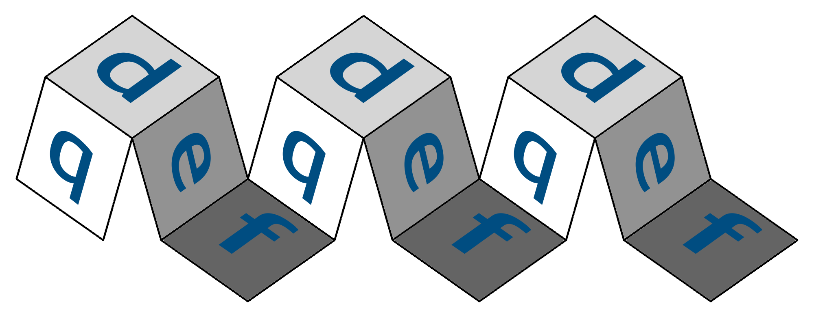
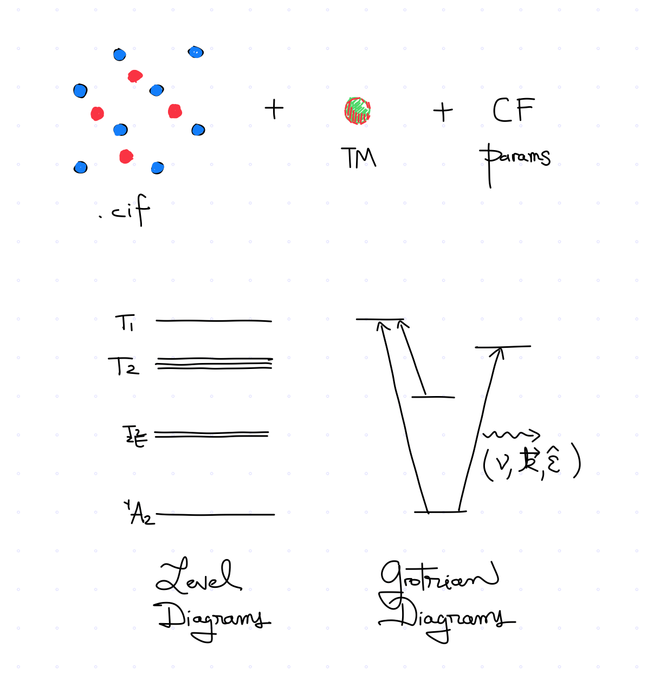

.. qdef documentation master file, created by
   sphinx-quickstart on Mon Jul 19 15:02:57 2021.
   You can adapt this file completely to your liking, but it should at least
   contain the root `toctree` directive.

================================

.. toctree::
   :maxdepth: 2
   :caption: Contents:

**qdef** is a collection of code and data used to approximate the optical properties of defects in crystals. It is an amalgam of group theory tables, spectroscopic databases, and experimental data for approximate Hamiltonians. Using these, for a given crystal host and dopant species, *qdef* determines all that may be said from symmetry considerations alone, and if more is given, then it can also say a few other things that may be calculated from approximate descriptions.

It is a remarkable fact that an atom may find itself in a crowded neighborhood of atoms and still retain many of the qualities it would have in complete isolation. Often is the case that this blessing comes at the price of a few of  its own electrons, but after that, the crystal host only demands as further ransom that the dopant plays to the tune of the crystal's own symmetry. *qdef* is agnostic as to how many electrons will be robbed from the dopant, but in trade it offers what would occur for a range of ionization states.

If the defect can be in a site with octahedral or trigonal symmetry, and if crystal field parameters are available for the given host, *qdef* can further estimate the level structure, together with oscillator strengths, and transition rates. Most importantly, it also provides the states, from which one may calculate the effects of other perturbations (electric, and magnetic) to which the defect may be subject to.

As many problems in quantum mechanics, the problem of an atom that finds itself in the belly of a solid host is a problem which is simple to solve in principle with `nothing` else being required but solving Schrodinger's equation for it and the myriad atoms around it. In practice, however, this matter is not simple, and  the approximate solutions that are afforded to us require treading with care through narrow passages in the climbing of a mountain which is sky high. These narrow passages include:

- constructing adequate multi-electron functions that simplify the solution of the approximate Hamiltonian;
- simplifying the matrix elements of multi-electron operators to sums of matrix elements of single-electron operators between single-electron states;
- and ...

Another price that a host enacts of a dopant is that phonons from the crystal lattice will often participate in the electronic transitions of the dopant, this gives rise to broadening of its transition lines. This is a temperature-dependent phenomenom, of which *qdef* makes no attempt to solve quantitatively, but which it does approximate with the following set of heuristics: one and two.

Another caveat is that the host offers a surrounding electromagnetic medium to the dopant which will vary its optical properties as a function of wavelength. In consequence, another allowance that must be made to better approximate the optical properties on a wide range of wavelengths, is that of providing a sense of the dispersive properties of the crystal host. In *qdef* this is accomplished by integrating into the analysis, models for the refractive index of the considered host as a function of wavelength.

These precision of the calculations offered by *qdef* is inherited by the approximations included in the following Hamiltonian:

.. math::
   \hat{H} = \sum_i \frac{\mathbf{\hat{p}}^2}{2m_i}
   + \sum_i \frac{Z'e^2}{|\hat{r}_i|}
   + \sum_{i,j} \frac{Ze^2}{|\hat{R}_j-\hat{r}_i|}
   + \sum_{i,j} \frac{e^2}{|\hat{r}_j-\hat{r}_i|}
   + \zeta(r) \hat{L}\cdot\hat{S}.

Where ... and ...

At a minimum the input of a calculation requires a .cif file for a given crystal host, and a transition metal species, this returns many of the things that can be said from symmetry considerations alone. In addition, if a more in-depth analysis is desired, the following are also needed: crystal field parameters, and the dispersion relationship for the crystal host.

It can also be seen as a library of sorts where those interested in trailing the bibliography for the analysis of many such defects in crystals may go.

For its calculations *qdef* owes a debt of gratitude to many. Its group theory tables was obtained from `GTPack <https://gtpack.org>`_, the crystal structure files that were used in its development were obtained from the `Materials Project <https://materialsproject.org>`_, and the crystal field parameters included in it were obtained from a number of references including the works of Morrison and ...

This work was written by David Lizarazo and Christopher Dodson who found it time to make a summary of all that could be said about the interesting case of atoms that manage to keep a good amount of individual freedom within a sea of electrons.

qdef.py
==================

.. automodule:: qdef
   :members:

Indices and tables
==================

* :ref:`genindex`
* :ref:`modindex`
* :ref:`search`
